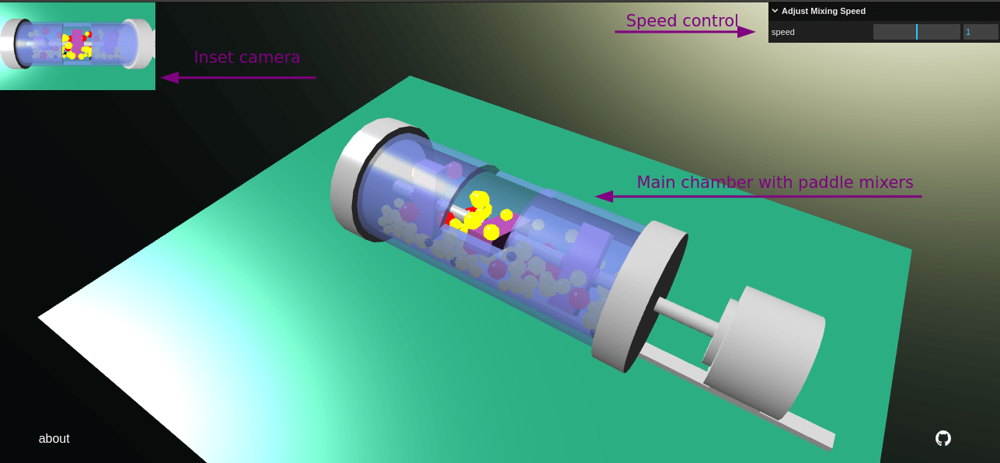
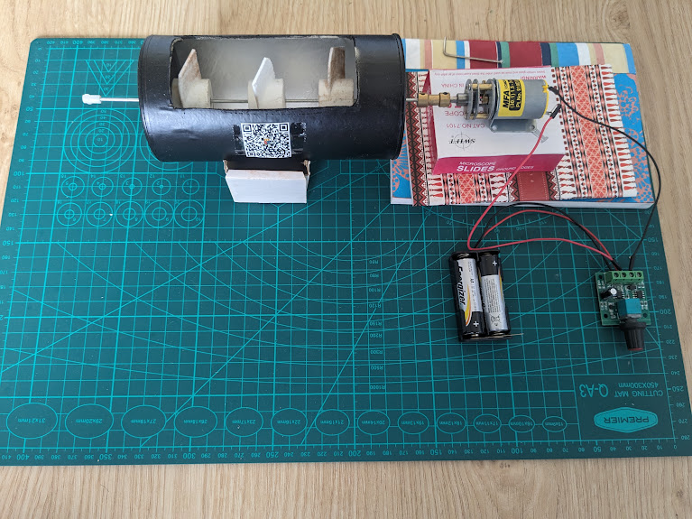

# MixSim

This is a basic 3D simulation of a multi-paddle dry mixer.
Such equipment is commonly used in the chemical, pharmaceutical and
food industries to blend powders and particulates.

The simulation was primarily created to accompany a corresponding
physical model in a research laboratory.
A secondary motivation was to investigate Babylon.js as an alternative
to Sketchfab for creating interactive 3D scenes for teaching and
research.
In addition, I wanted to get more familiar with TypeScript development.

 

## Testing

Clone the repository and install dependencies.

```bash
git clone git@github.com:edibotopic/mix-sim.git # SSH
# or with HTTPS: 
# git clone https://github.com/edibotopic/mix-sim.git
cd mix-sim
npm install # install dependencies
```
To _test_ the simulation run `npm run dev` or to _build_ run
`npm run build`.

## Physical Model

The simulation was based on the physical model shown below.
This was constructed using cheap electrical components,
repurposed metal and carboard, along with 3D-printed paddles:

 

## Implementation

The simulation is implemented using TypeScript and the Babylon.js 3D engine.
The main scene consists of a horizontal, cylindrical chamber.
In the chamber, a polydispersed particle population is being mixed.
Particles collide with each other, the paddles and the chamber walls.
Classes of particles are coloured according to their size (small=black, medium=yellow, large=red).
A main camera can be moved to inspect the simulation.
An inset camera can be used to observe a top-down view of the mixing behaviour.
A basic slider (built using lil-gui) allows users to control the mixing speed in the chamber.

## Limitations

### Model

The geometrical modelling was done using Babylon.js primitives (cylinders, boxes, spheres) and Boolean operations (union, subtraction) alone.
As no dedicated modelling software was used (e.g., Blender), the designs are rudimentary in nature.

### Collisions

An array of invisible "backup" collision impostors extends around the central chamber to prevent particles escaping the main chamber — this is not perfect (particles may occasionally still escape) and probably not performant either.

### Performance

There are ~100 particles (with their own physics) being simulated and this may cause some frame-rate drops depending on your hardware.
In my most recent tests (browsers: Firefox, Chrome; computers: Lenovo Thinkpad, Lenovo P11 Plus) the frame-rate averaged 60-80 FPS with no noticeable dips.
It would be good to have an option for the user to adjust the number of particles in the scene to suit their device.

The simulation was created using Babylon.js version 5.4.
Newer versions have since been released with improved performance
and physics capabilities.

### Screen Orientation

The app should probably be locked to landscape orientation on mobile
devices and does not transition well between orientations, usually
requiring a refresh.

## Plans

The project is archived as of 15-12-2023 and
will not be developed further.
